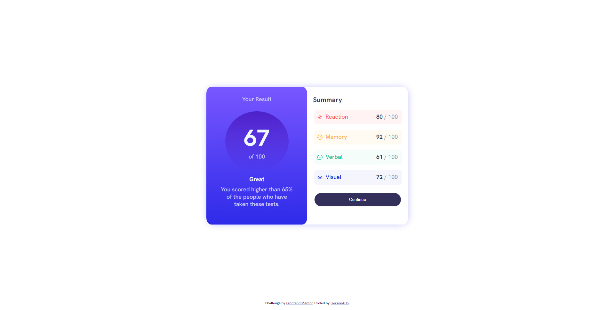

# GersonADS
## Results-summary-component
---
### Overview
#### Screenshot

---
### Links

- Live Site URL: [See the Project Online !](https://gersonads.github.io/Results-summary-component/)

## My process

### Built with

- Semantic HTML5 markup
- CSS custom properties
- Flexbox

### What I learned

How to do a better positioning. 

### Useful resources

- [W3C](https://www.w3schools.com/css/css3_gradients.asp) - This topic helped me a lot, i never did a gradient with css, this was a very good topic. 

## Author

- GitHub - [Gerson_ADS](https://github.com/GersonADS)
- Frontend Mentor - [@GersonADS](https://www.frontendmentor.io/profile/GersonADS)
